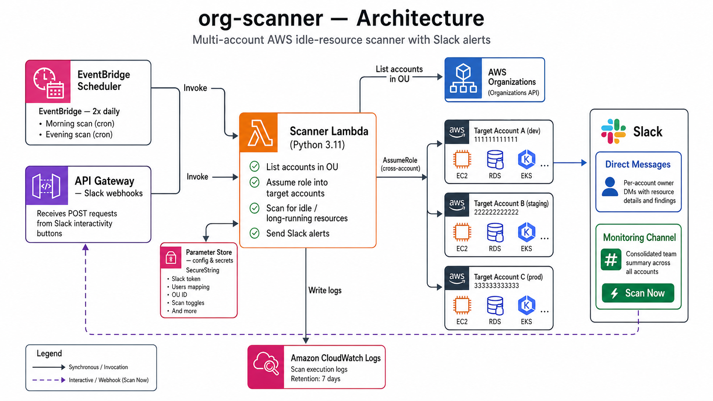

# org-scanner

Multi-account AWS idle resource scanner with Slack alerts and one-click stop actions, deployed via Terraform.

Runs as a Lambda on a scheduled EventBridge cron. Assumes a cross-account role into each target account, scans for idle or unexpectedly long-running resources across 11 resource types, filters against configurable time/count thresholds, then sends Slack DMs to account owners and a summary to a monitoring channel. A Slack button on the monitoring message triggers a separate API Gateway endpoint to stop resources on demand.

---

## What it scans

| Resource | Alert condition |
|---|---|
| EC2 instances | Running > N hours, or stopped > N hours |
| RDS instances | Running > N hours |
| EKS clusters | Running > N hours |
| NAT Gateways | Count > 0 |
| Load Balancers | Count > 0 |
| EBS volumes | Unattached > N hours OR count > N |
| Elastic IPs | Idle > N hours OR count > N |
| VPC Endpoints | Count > N |
| Lightsail instances | Age > N hours OR count > N |
| EBS snapshots | Count > N |
| RDS snapshots | Age > N hours OR count > N |

All thresholds are configurable per account via Terraform variables.

---

## Architecture



Two trigger paths feed the Scanner Lambda:

- **Scheduled scans** — EventBridge fires the Lambda on a configurable cron (default: morning + evening, Sun–Thu).
- **On-demand scans** — the "Scan Now" button in the Slack monitoring channel POSTs to API Gateway, which invokes the same Lambda.

Each invocation lists accounts in the configured OU via the AWS Organizations API, then assumes a cross-account role (`OrganizationAccountAccessRole` by default) into each target account to scan for idle or long-running resources. Findings are posted as direct messages to per-account owners and as a consolidated summary to the monitoring channel.

Infrastructure is defined as Terraform modules with a workspace-per-account pattern.

---

## Terraform layout

```
terraform/
├── main.tf                         # Root: workspace validation + module call
├── variables.tf                    # Root input variables
├── providers.tf                    # AWS provider config
├── modules/
│   └── account-scanner/            # Reusable module (Lambda, IAM, EventBridge, API GW, SSM)
└── accounts/
    └── example.tfvars              # Template — copy and fill in per account
```

One Terraform workspace per target account. Deploy with:

```bash
terraform workspace new dev
terraform apply -var-file=accounts/dev.tfvars
```

---

## Configuration

Configuration is split between Terraform variables (infrastructure) and Parameter Store (runtime secrets).

**Terraform variables** ([terraform/accounts/example.tfvars](terraform/accounts/example.tfvars)):
- `account_name` — workspace name (must match Terraform workspace)
- `ou_id` — AWS Organizations OU ID containing the accounts to scan
- `users_mapping` — map of account names to `{id, email}` for Slack DMs
- `slack_token` — bot token (sensitive)
- `monitoring_channel` — Slack channel for summaries
- `morning_scan_cron`, `evening_scan_cron` — EventBridge cron expressions
- `scan_toggles` — enable/disable individual resource types
- `threshold_*` — per-resource alert thresholds (see [THRESHOLDS.md](THRESHOLDS.md))

**Parameter Store** (written by Terraform, read by Lambda at runtime):
- `/org-scanner/{account}/slack-token`
- `/org-scanner/{account}/users-mapping` (JSON)
- `/org-scanner/{account}/ou-id`
- `/org-scanner/{account}/regions`
- `/org-scanner/{account}/scan-toggles` (JSON)

---

## Alert thresholds

All thresholds have sensible defaults and can be overridden per account in `accounts/*.tfvars`. See [THRESHOLDS.md](THRESHOLDS.md) for the full reference.

```hcl
# Example override in accounts/dev.tfvars
threshold_ec2_running_hours = 6    # Alert on EC2 running > 6h (default: 12)
threshold_nat_gateway_count = 1    # Allow 1 NAT GW (default: 0)
```

---

## Slack integration

The Lambda uses a Slack bot token to:
1. Find a user by email (`users_mapping` email field → Slack user lookup)
2. Open a DM and send a per-resource alert with a "Stop" action button
3. Post a consolidated summary to the monitoring channel

The "Scan Now" / "Stop" buttons on monitoring messages POST to an API Gateway endpoint that re-invokes the Lambda with the button payload. Slack request signature verification (HMAC-SHA256) is enforced.

---

## Deploy

```bash
# Initialize
cd terraform
terraform init

# Create workspace for a new account
terraform workspace new dev

# Deploy
terraform apply -var-file=accounts/dev.tfvars
```

See [docs/adding-new-account.md](docs/adding-new-account.md) for the full workflow.

---

## Development

```bash
python -m venv venv && source venv/bin/activate
pip install -r requirements.txt
pip install -r dev/config/requirements-dev.txt
pytest dev/tests/ -v
```

Tests use mocks — no real AWS or Slack calls.

See [DEVELOPMENT.md](DEVELOPMENT.md) for project layout, key code locations, packaging, the Terraform workflow, and gotchas.

---

## License

MIT
